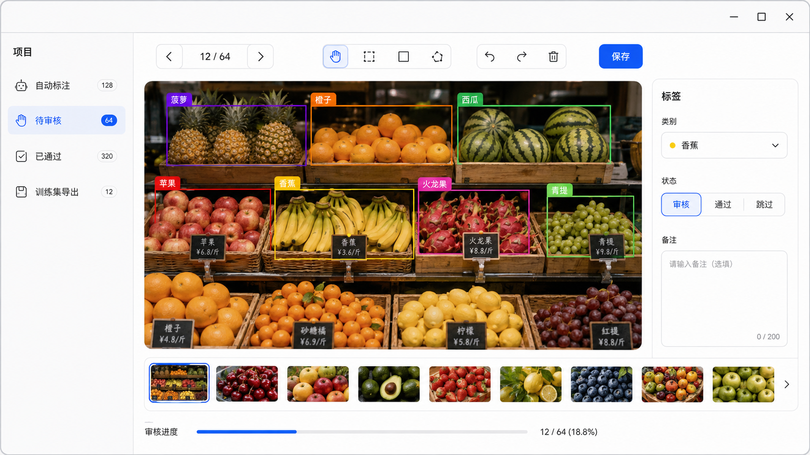

# autoLabel

一个面向本地数据集的桌面自动标注工作台。它把“创建项目 → 导入图片 → 自动预标注 → 人工审核 → 导出训练集 / 微调”串成一个可持续使用的闭环；图片、VOC XML 与项目数据都留在本地项目目录中。



> 审核工作台示例：批量预标注后，在画布中直接选择、移动、缩放、改类并审核通过。

## 功能

- **项目化管理**：新建或打开项目；自动保存最近项目和最后一次打开的项目。
- **本地持久化**：每个项目以 SQLite 保存类别和审核状态，标注仍以通用 VOC XML 保存，便于携带、备份和使用 LabelImg 打开。
- **自动标注**：支持 Grounding DINO 1.5、Grounding DINO 和已微调的 YOLO；文本提示词可一次标注多个类别。
- **可编辑审核画布**：滚轮缩放、拖拽平移、选择/移动标注框、四角与四边缩放、矩形新建、修改类别、撤销/重做、删除与保存。
- **审核流转**：自动标注结果进入“待审核”；可通过、跳过，已通过图片会进入导出训练集流程。
- **训练闭环**：导出 VOC → YOLO 数据集并使用 Ultralytics YOLO 微调，训练结果可回到自动标注页继续使用。

## 快速开始

### 1. 安装依赖

建议在 Python 3.10+ 环境中安装：

```bash
pip install -r requirements.txt
```

项目内已带有 Grounding DINO 相关源码。若希望 GPU 加速，请先按 PyTorch 官方说明安装与 CUDA 对应的 `torch` / `torchvision`。

### 2. 启动

```bash
python main.py
```

首次使用时，点击左侧“项目”旁的 `•••`：

1. 选择“新建项目”，指定项目名称和保存位置；或选择“导入 / 打开项目”。
2. 在“自动标注”页导入图片、配置类别提示词与模型。
3. 点击“开始自动标注”。结果会自动写入项目并进入“待审核”。
4. 在“待审核”中修正标注，选择“通过”。
5. 在“训练集导出”中导出数据集或开始微调。

下次启动时会自动恢复上一次打开的有效项目；左侧同时提供最近项目快捷入口。

## 审核操作

| 操作 | 快捷键 |
| --- | --- |
| 上一张 / 下一张 | `←` / `→` |
| 平移画布 | `H` |
| 选择、移动和缩放框 | `V` |
| 新建矩形框 | `R` |
| 打开 / 关闭标注清单 | `L` |
| 撤销 / 重做 | `Ctrl+Z` / `Ctrl+Shift+Z` |
| 删除选中框 | `Delete` |
| 保存 XML 标注 | `Ctrl+S` |

选择框后可直接在右侧修改类别。选中状态会使用该类别对应的浅色蒙层和边框颜色；拖动框内部可移动，拖动四角或四边手柄可调整大小。图片内框很多时，可打开“标注清单”抽屉，按类别或关键词筛选，点击行定位对应框，并单独显示或隐藏每个框。

## 项目目录

每个项目都是一个可复制、可独立管理的目录：

```text
my-project/
├── autolabel.project.json  # 项目描述与目录约定
├── autolabel.db            # SQLite：类别、审核状态等工作流数据
├── images/                 # 项目图片
├── annotations/            # VOC XML 标注
└── yolo_dataset/           # 导出后的 YOLO 数据集
```

应用级的最近项目与最后项目记录保存在用户本地的 `workspace.db` 中，不需要安装 MySQL 或运行任何服务。

## 模型说明

| 模型 | 适用场景 |
| --- | --- |
| Grounding DINO 1.5（推荐） | 零样本冷启动，适合先快速生成预标注。 |
| Grounding DINO | 兼容旧版权重。 |
| YOLO（微调） | 使用已审核的数据训练后，适合稳定的业务类别。 |

Grounding DINO 使用英文文本编码器，类别提示词建议使用英文并以英文句点分隔，例如：

```text
person . helmet . forklift
```

## 命令行与微调

除桌面工作台外，也可直接调用核心批处理：

```python
from core import batch_process

batch_process("images", "annotations", "person . dog . cat")
```

导出 YOLO 数据集：

```bash
python tools/export_yolo.py --images images --annotations annotations --out yolo_dataset
```

启动 YOLO 微调：

```bash
python tools/train_yolo.py --data yolo_dataset/dataset.yaml --model yolov8s.pt --epochs 100 --imgsz 640
```

训练完成后，将 `best.pt` 放入 `weights/yolo_best.pt`，并在工作台中切换到“YOLO（微调）”，即可继续进行预标注 → 审核 → 再训练的迭代。

## 主要结构

```text
main.py                 # 应用入口（Qt 工作台）
gui/qt_workbench.py     # 项目、自动标注、审核、导出工作台
project.py              # 项目描述、项目 SQLite 与工作区 SQLite
core.py                 # 模型加载、自动标注、VOC XML 读写
finetune.py             # 微调逻辑
tools/                  # VOC → YOLO 导出与训练脚本
weights/                # 本地模型权重
```
