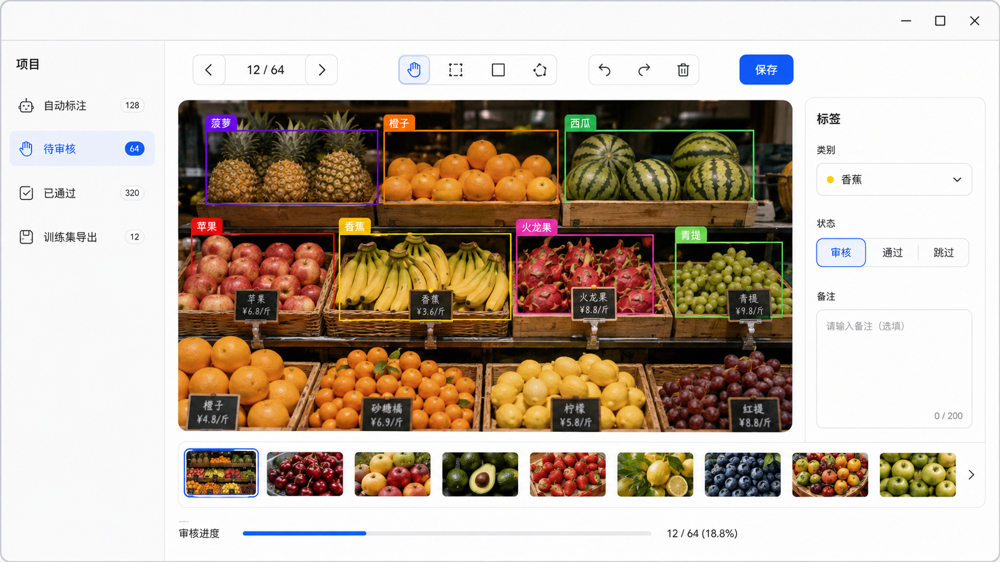

# autoLabel

一个面向本地数据集的桌面自动标注工作台。它把“创建项目 → 导入图片 → 自动预标注 → 人工审核 → 导出训练集 / 微调”串成一个可持续使用的闭环；图片、VOC XML 与项目数据都留在本地项目目录中。



> 审核工作台示例：批量预标注后，在画布中直接选择、移动、缩放、改类并审核通过。

## 功能

- **项目化管理**：新建或打开项目；自动保存最近项目和最后一次打开的项目。
- **本地持久化**：每个项目以 SQLite 保存类别和审核状态，标注仍以通用 VOC XML 保存，便于携带、备份和使用 LabelImg 打开。
- **自动标注与重跑**：支持 YOLOE 开放词表检测、Grounding DINO、已微调的 YOLO 和项目内导入的自定义 YOLO `.pt`；文本提示词可一次标注多个类别，并可只重跑风险队列或全部待审核图片。
- **可编辑审核画布**：滚轮缩放、拖拽平移、选择/移动标注、矩形框与多边形新建、框缩放、顶点编辑、修改类别、撤销/重做与自动保存。
- **风险审核与版本留痕**：用空标注、低置信度、重复框、越界框、极小框和异常标注等质量规则计算风险分；风险队列优先显示高风险图片，重跑与恢复前的 XML 都会保存为可恢复版本。
- **审核流转**：自动标注结果进入“待审核”；可通过、跳过或退回修改，已通过图片会形成项目级训练候选集。
- **最终抽检**：可从训练候选中随机抽取 5、10 或 20 张，进入审核画布逐张核验；抽检通过保留候选，需修改则退回待审核。
- **训练闭环**：在工作台内导出 VOC → YOLO 数据集并使用 Ultralytics YOLO 微调，训练结果保存到项目 `models/`，可回到自动标注页继续使用。

## 快速开始

### 1. 安装依赖

建议在 Python 3.10+ 环境中安装：

```bash
pip install -r requirements.txt
```

项目内已带有 Grounding DINO 相关源码。若希望 GPU 加速，请先按 PyTorch 官方说明安装与 CUDA 对应的 `torch` / `torchvision`。

### 2. 启动

```bash
python main.py
```

首次使用时，点击左侧“项目”旁的 `•••`：

1. 选择“新建项目”，指定项目名称和保存位置；或选择“导入 / 打开项目”。
2. 在“自动标注”页导入图片、配置类别提示词与模型。
3. 如需使用自己的 YOLO 权重，可点击自动标注页右上角“导入自定义模型”；模型会复制到项目目录并可随项目携带。
4. 点击“开始自动标注”。默认只处理未标注图片；需要重新预标注时，可改为“风险队列”或“所有待审核图片”。结果会自动写入项目并进入“待审核”。
5. 在“待审核”中修正标注，选择“通过”。
6. 在“已通过 · 训练候选”中查看类别统计、设置本项目训练图片目标；如需抽检，随机抽取后点击“开始抽检”，在审核画布中完成最终核验。
7. 在“模型微调”中导出数据集或开始微调。

下次启动时会自动恢复上一次打开的有效项目；左侧同时提供最近项目快捷入口。左侧会以工作区卡片显示当前项目名称和根目录，并提供关闭、从最近项目移除，以及“输入项目名后二次确认”的完整删除操作。新建项目会在所选位置创建独立项目文件夹，图片导入至该项目的 `images/`，标注写入 `annotations/`，模型、标注版本与训练集也始终保存在同一项目目录内。

自动标注页的“最低置信度”可直接过滤写入 XML 的候选框：默认 25%。单人目标疑似漏检时可先降到 15%–20% 观察候选框；误检较多时再提高到 35%–50%。

## 审核操作

| 操作 | 快捷键 |
| --- | --- |
| 上一张 / 下一张 | `←` / `→` |
| 长按上一张 / 下一张 | 连续快速跳转图片 |
| 平移画布 | `H` |
| 选择、移动和缩放框 | `V` |
| 新建矩形框 | `R` |
| 新建多边形 | `P`；逐点点击，双击最后一点闭合 |
| 打开 / 关闭标注清单 | `L` |
| 撤销 / 重做 | `Ctrl+Z` / `Ctrl+Shift+Z` |
| 删除选中框 | `Delete` |
| 保存 XML 标注 | `Ctrl+S` |
| 通过并下一张 | `A` |
| 跳过并下一张 | `S` |

选择标注后可直接在右侧修改类别。选中状态会使用该类别对应的浅色蒙层和边框颜色；矩形支持拖动、八点缩放，多边形支持拖动与顶点调整。新增多边形时逐点点击，点击首点或双击最后一点闭合；右键可取消当前拉线。修改会自动保存，点击“通过”或“跳过”也会先保存。图片内框很多时，可打开“标注清单”抽屉，按类别或关键词筛选，点击行定位对应标注，并单独显示或隐藏每项。审核图片很多时，底部按当前位置预加载缩略图，连续切换、长按翻页和拖动缩略图栏都保持流畅。

待审核可切换“风险队列”：它会隐藏未命中质量规则的图片，只保留需要关注的结果并按风险分由高到低排列。工具栏会展示高风险、待关注和已隐藏无风险图片的数量，缩略图左上角的数字也会标出每张图片的风险分；右侧检查器可查看命中的规则。工具栏的“版本”可查看并恢复当前图片的预标注结果。重新预标注或恢复历史结果前，应用都会先保存当前 XML；因此可放心比较不同模型或提示词的结果。

## 已通过候选与最终抽检

“已通过”页是训练数据的最终确认区，而不是单纯的历史列表。顶部会自动统计已通过图片内实际出现的类别及标注框数量；“目标”可按项目设置，只用于提示候选规模是否达到预期。

抽检不在候选卡片上直接确认。点击“随机抽取”后，页面会筛到“待抽检”并显示待核验/已完成进度；点击“开始抽检”会进入审核画布的最终抽检队列。此时选择“通过”会记录抽检通过，选择“审核”会把图片退回待审核，避免在缩略图列表中做无法看清细节的决策。

工具栏右侧的 `⌘` 按钮可打开按用途分组的快捷键速查。标注清单中的方框用于控制单项在画布中的可见性：带蓝色勾表示显示，空框表示隐藏。备注会随输入自动保存到项目 SQLite。

### 模型分数与人工状态

`置信度`只表示模型对预测框的把握程度，用于低置信度质量规则和风险队列排序；它不是人工标注质量分。人工新建的框显示“人工标注”，修改模型框后显示“已修订”，审核通过后显示“已核验”，三种状态都不会伪造为 100% 置信度，并会随 XML 一同保存。

### 标注兼容性

矩形标注以标准 VOC `bndbox` 保存。多边形在同一个 VOC XML 中额外保存 `polygon` 点集，同时保留其外接矩形，因此现有 VOC 工具仍可读取并使用该标注的边界框；重新在 autoLabel 中打开即可继续编辑多边形。

## 项目目录

每个项目都是一个可复制、可独立管理的目录：

```text
my-project/
├── autolabel.project.json  # 项目描述与目录约定
├── autolabel.db            # SQLite：类别、审核状态、备注等工作流数据
├── images/                 # 项目图片
├── annotations/            # VOC XML 标注
├── annotation_versions/    # 自动重跑和恢复前保存的 XML 版本
├── models/                 # 右上角导入的项目专用 YOLO .pt 模型
└── yolo_dataset/           # 导出后的 YOLO 数据集
```

应用级的最近项目与最后项目记录保存在用户本地的 `workspace.db` 中，不需要安装 MySQL 或运行任何服务。

## 模型说明

| 模型 | 适用场景 |
| --- | --- |
| YOLOE（推荐） | 开放词表预标注；可用现有英文类别提示词，首用时自动下载官方权重。 |
| Grounding DINO（兼容旧模型） | 保留现有本地 `grounding-dino-base` 权重的兼容后端。 |
| Grounding DINO | 兼容旧版权重。 |
| YOLO（微调） | 使用已审核的数据训练后，适合稳定的业务类别。 |

Grounding DINO 使用英文文本编码器，类别提示词建议使用英文并以英文句点分隔，例如：

```text
person . helmet . forklift
```

## 命令行与微调

除桌面工作台外，也可直接调用核心批处理：

```python
from core import batch_process

batch_process("images", "annotations", "person . dog . cat")
```

导出 YOLO 数据集：

```bash
python tools/export_yolo.py --images images --annotations annotations --out yolo_dataset
```

启动 YOLO 微调：

```bash
python tools/train_yolo.py --data yolo_dataset/dataset.yaml --model yolov8s.pt --epochs 100 --imgsz 640
```

训练完成后，将 `best.pt` 放入 `weights/yolo_best.pt`，并在工作台中切换到“YOLO（微调）”，即可继续进行预标注 → 审核 → 再训练的迭代。

## 主要结构

```text
main.py                 # 应用入口（Qt 工作台）
gui/qt_workbench.py     # 项目、自动标注、审核、导出工作台
project.py              # 项目描述、项目 SQLite 与工作区 SQLite
core.py                 # 模型加载、自动标注、VOC XML 读写
finetune.py             # 微调逻辑
tools/                  # VOC → YOLO 导出与训练脚本
weights/                # 本地模型权重
```
